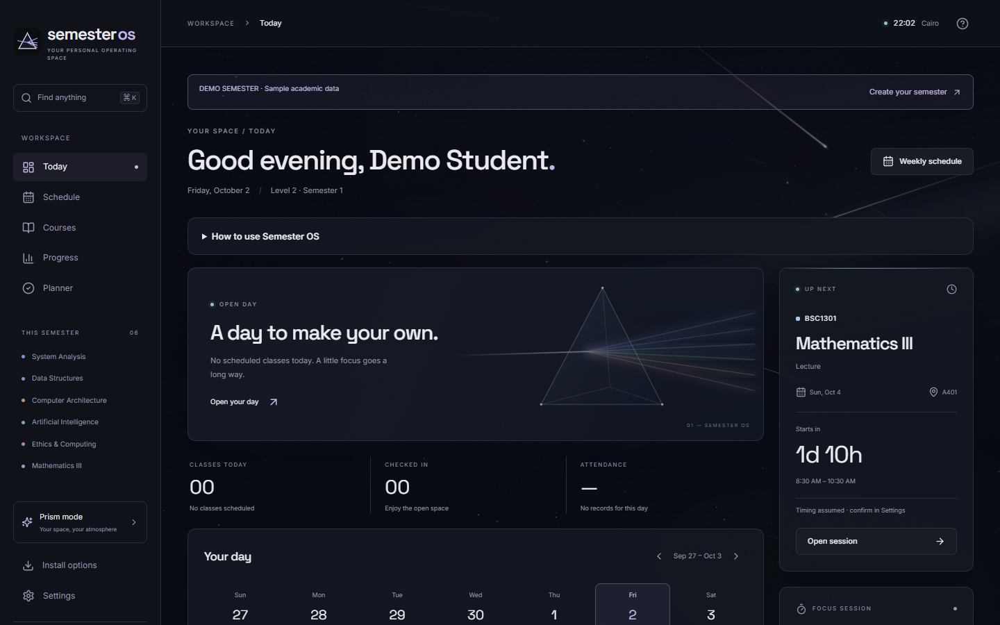
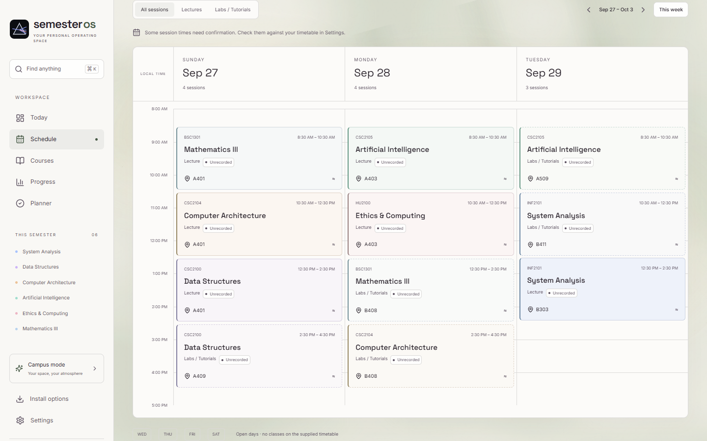
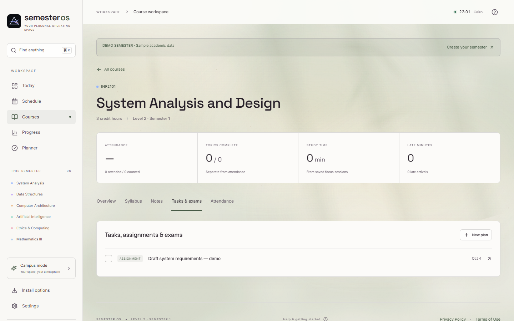
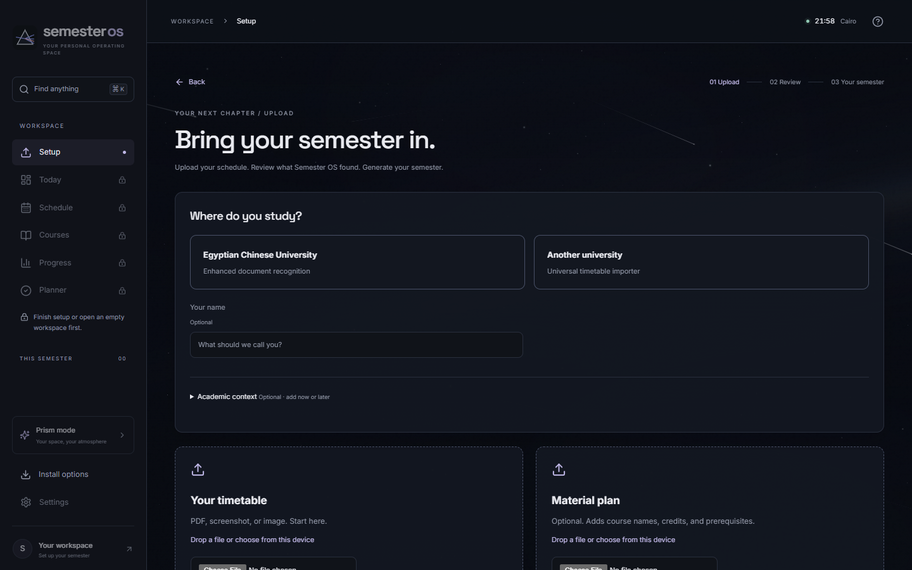
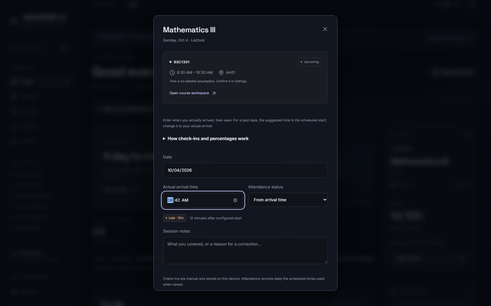
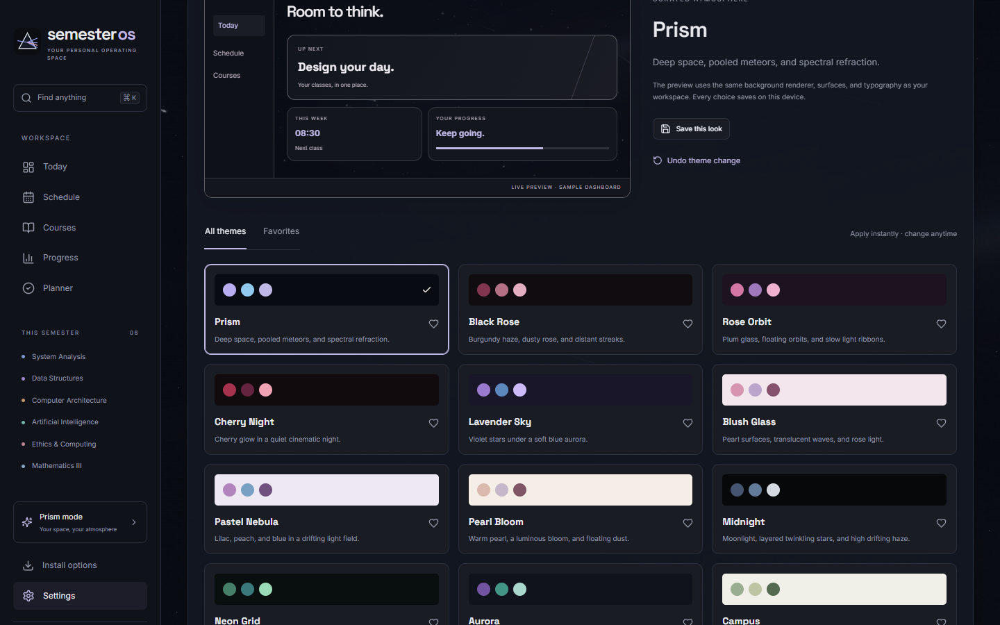

# Semester OS

**Your classes, plans, notes, and progress. One workspace for your semester.**

Local-first · Accountless · Offline-capable PWA

[**Try the live beta →**](https://semester-os-4y6.pages.dev) · [GitHub](https://github.com/zoghby-ctrl/semester-os) · [Development](#development)

Built primarily for **Egyptian Chinese University (ECU) Computer Science students**, the audience tested most deeply. **Other universities, faculties, programs, levels, and semesters are supported** through the generalized timetable importer and editable academic context.



## One place for the whole semester

- **Today & Schedule:** next classes, rooms, weekly timetable, filters, and editable times.
- **Course workspaces:** notes, topics, assignments, manual attendance, lateness, and saved study sessions.
- **Planner & Progress:** deadlines, tasks, attendance history, and study progress.
- **Your atmosphere:** 13 curated themes plus Custom, live previews, favorites, and reduced-motion controls.
- **Recovery & access:** validated backups, recovery points, keyboard search, and desktop/phone layouts.

| Weekly schedule · Campus | Course workspace · sample assignment |
| --- | --- |
|  |  |

## Bring your semester in

**Upload → Review → Generate → Use daily.** Choose **Egyptian Chinese University** for enhanced recognition of selected ECU document layouts, or **Another university** for the generalized English timetable importer. Upload a PDF or image; an academic/material plan is optional. You can also enter courses manually, explore the labelled **Demo Semester**, or open an empty workspace.

Academic context is optional and editable; fresh setup does not preselect a university, faculty, program, level, or term. Generic imports do not receive ECU metadata. Review courses, weekdays, times, rooms, and suggested context against the official document before generating your workspace. Unrecognized fields can be corrected manually; missing information stays unknown. English OCR does not transcribe Arabic image text, and recognition is not guaranteed for every layout.



Semester OS is independent and **not affiliated with or endorsed by ECU or any other university**. See [Product generalization](docs/PRODUCT_GENERALIZATION.md) for importer scope and validation.

## Local-first and offline-capable

No account or university login is required. Academic records stay in your browser's IndexedDB; PDF extraction and OCR run locally. There is no student backend, cloud sync, remote OCR, or application telemetry. The host receives ordinary application-asset requests.

Install the PWA from your browser; on iPhone/iPad use **Share → Add to Home Screen**. Core pages can reopen offline once the application shell is cached. For offline imports, prepare the separate extraction tools (approximately 24 MB) in **Settings → Data & backup** while online.

Attendance is manual. Source documents/previews are temporary and excluded from backups. **Backups are unencrypted; export regularly**, keep them private, and save active study sessions first. Browser storage can be cleared or evicted, and each device/browser/origin has separate storage.

| Arrival and lateness | Appearance and themes |
| --- | --- |
|  |  |

[Launch screenshots and phone layouts](docs/screenshots/README.md) use empty or labelled demo workspaces and synthetic coursework.

## Development

Use **Node 24** (CI), or Node 22.13+ with compatible npm.

```sh
npm ci
npm run dev          # http://127.0.0.1:5173
npm run verify      # complete automated release checks
node serve.mjs      # production build: http://127.0.0.1:4173
```

The documented validation baseline is **265 passing tests in 21 files**, plus lint, strict TypeScript, production/PWA builds, dependency audits, privacy/security scans, and deployment checks. See [Validation](VALIDATION.md), [Architecture](docs/ARCHITECTURE.md), [Contributing](CONTRIBUTING.md), and [Deployment](docs/DEPLOYMENT.md).

No build secret is required. `VITE_PROJECT_CONTACT` is public browser configuration; never put credentials there. See [.env.example](.env.example).

## Beta status and license

The [live beta](https://semester-os-4y6.pages.dev) includes the published university-generalization work. Review academic information against official sources and keep backups. Broader physical-device and student testing, operator/contact setup, and policy review remain [release-readiness tasks](docs/RELEASE_READINESS.md). Automated checks do not certify security, accessibility, OCR accuracy, or all-device reliability.

Report vulnerabilities privately as described in [SECURITY.md](SECURITY.md); configuring a monitored private reporting channel remains a release task.

**No source license has been selected.** Public source availability does not grant permission to reuse, modify, or redistribute the code. Dependencies retain their own licenses.

[Beta release preparation](docs/BETA_RELEASE_PREPARATION.md) · [Release notes](docs/releases/v0.1.0-beta.1.md)
