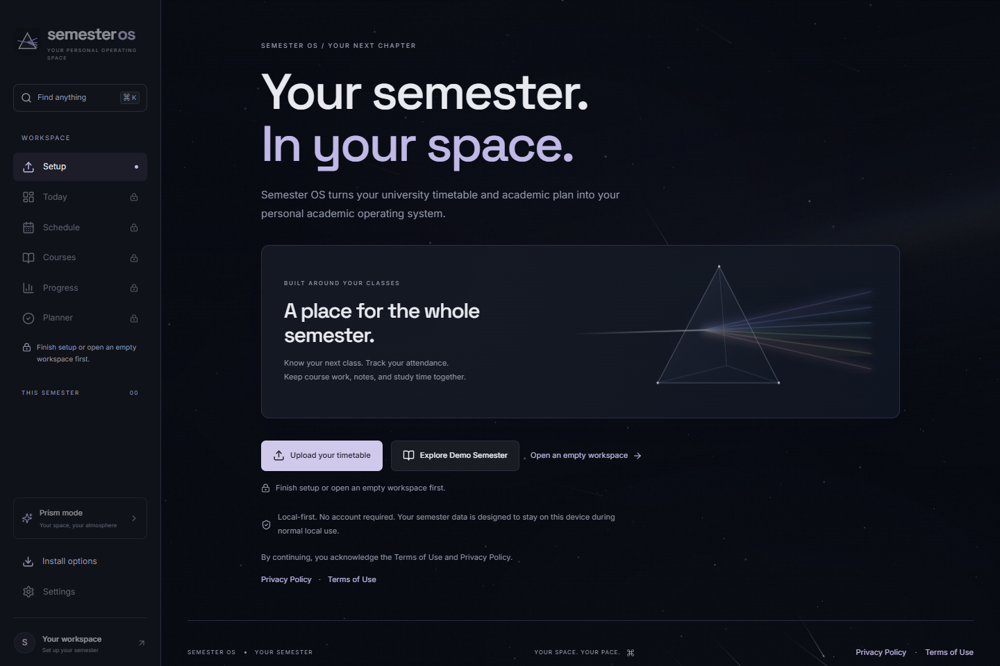
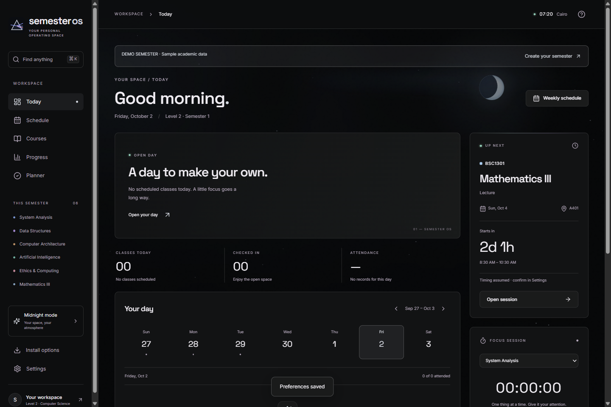
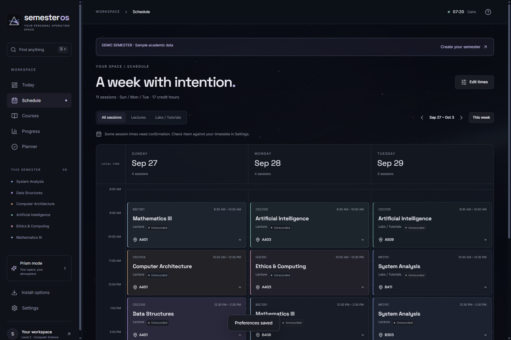
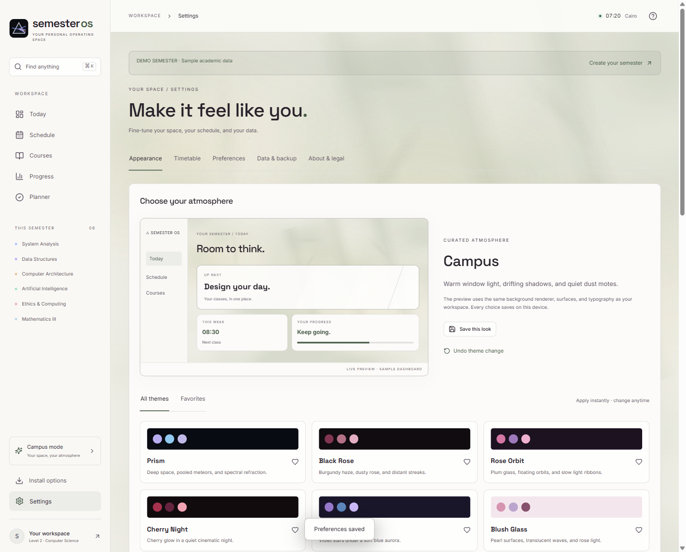
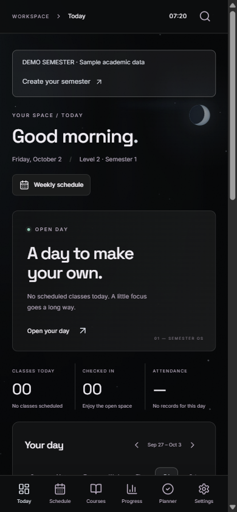
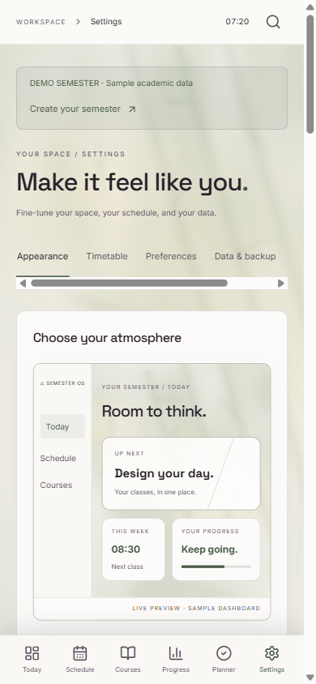
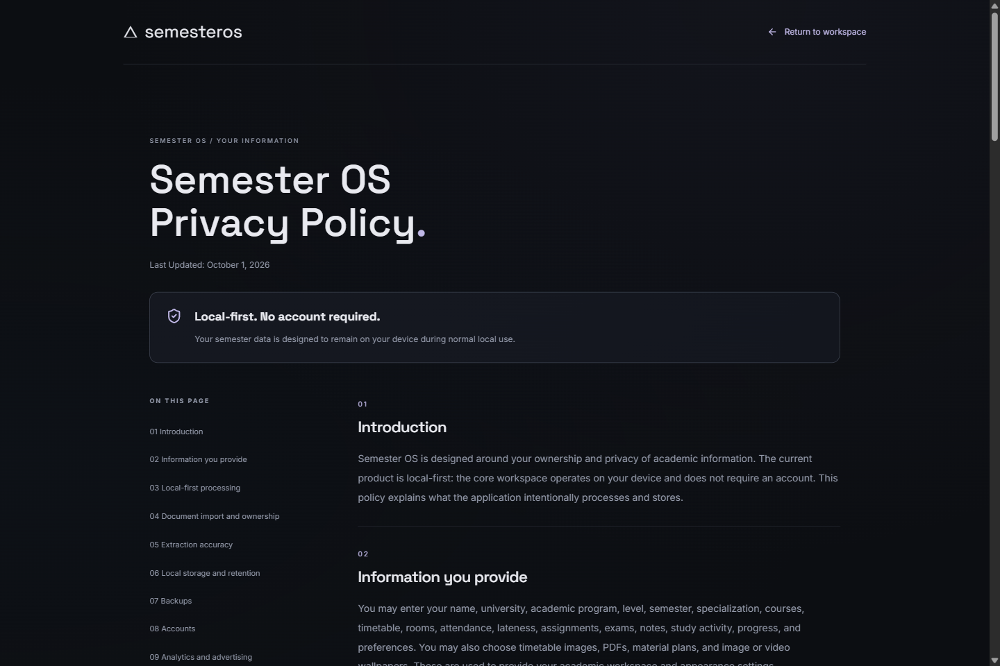

# Public screenshots — October 2, 2026

These seven screenshots are captured from the final local production/PWA build in isolated browser profiles. They show an empty workspace, authorized labelled demo metadata with a **blank display name**, or a public policy page. Browser chrome and addresses are not included.

| File | Content | Viewport |
| --- | --- | --- |
| welcome-desktop.png | Empty first-run welcome, locked workspace navigation and setup actions | 1440 × 960 |
| today-desktop.png | Anonymous labelled Demo Semester in Midnight | 1440 × 960 |
| schedule-desktop.png | Anonymous labelled Demo Semester weekly timetable in Prism | 1440 × 960 |
| appearance-desktop.png | Campus actual live preview and theme gallery | 1440 × 1160 |
| today-mobile.png | Anonymous labelled Demo Semester in Midnight | 390 × 844 |
| appearance-light-mobile.png | Campus actual live preview | 390 × 844 |
| privacy-desktop.png | Public Privacy Policy without a configured personal contact | 1440 × 960 |

Each image receives full-resolution visual review, a visible-DOM privacy check and local OCR inspection. No personal name (including Demo Student), student ID, email, account details, local Windows path, private source document or backup appears. Only these exact reviewed SHA-256 hashes are eligible for Git.

The welcome capture is refreshed for the first-run navigation continuation. The other six reviewed anonymous demo/policy captures are unchanged. None includes browser chrome, addresses or embedded PNG text/EXIF metadata.

| Midnight on a phone | Campus preview on a phone |
| --- | --- |
|  |  |

Original/private screenshots, source previews, student imports, recovery/backup files, OCR output and browser evidence remain ignored. Replacing an image requires another privacy review and an explicit hash update. Screenshots supplement the application's live rendered previews.
